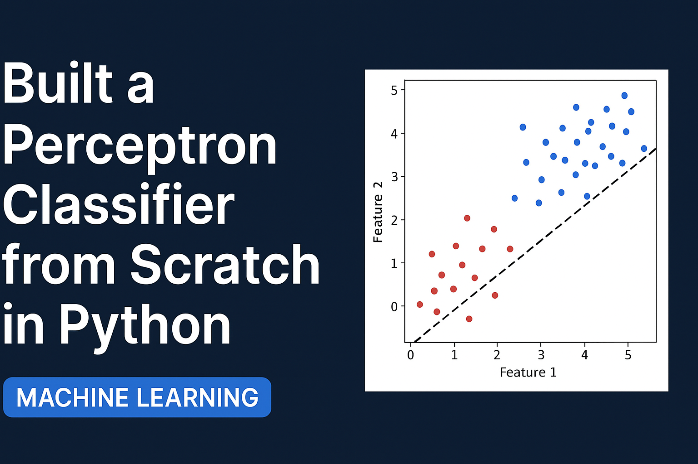

Perceptron Classifier from Scratch 
Objective: 
This project demonstrates how to build a Perceptron classifier from scratch using only NumPy for computation and Matplotlib for visualization. The perceptron learns to classify two classes in a 2D space, with an animated visualization of the decision boundary updating over epochs. 

 

Dataset:
We generate a synthetic binary classification dataset: 
Class 0: Centered near (1, 1) 
Class 1: Centered near (3, 3) 
100 samples per class 
Added bias term for perceptron learning 

 

Technologies Used:
Python – Programming language 
NumPy – Numerical operations 
Matplotlib – Visualization and animation 
FuncAnimation – To animate the decision boundary updates 

 

Key Features :
Implements perceptron learning rule from scratch 
Step-by-step weight updates per epoch 
Decision boundary visualization for each epoch 
Animated training process 

 

How It Works :
Initialize Weights – Random values for bias and features 
Predict – Apply linear combination of inputs and weights 
Update Weights – Using perceptron learning rule:        
         weights += learning_rate * error * X 
Repeat – Until max epochs reached 
Animate – Show decision boundary movement per epoch 

Results :
The decision boundary gradually moves to separate the two classes 
Animation clearly shows perceptron learning process 
Final weights correctly classify the dataset 

 

How to Run :
1.Clone the repository or download the files 
2.Install required libraries: 
        pip install numpy matplotlib 
3.Run the script: 
        python perceptron_classifier.py 
 
4.The animation will display, showing the perceptron learning process 

Acknowledgement: 
This project is inspired by the basic perceptron learning algorithm, a fundamental building        block for understanding machine learning concepts. 

 
